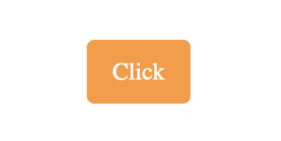
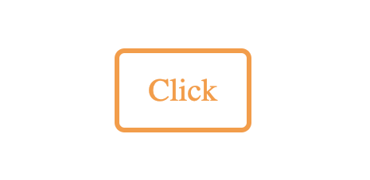
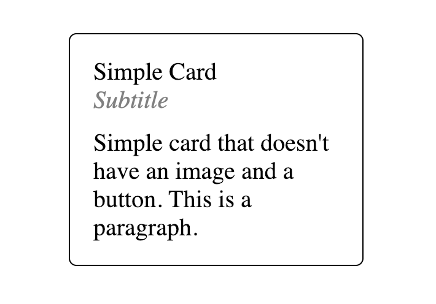
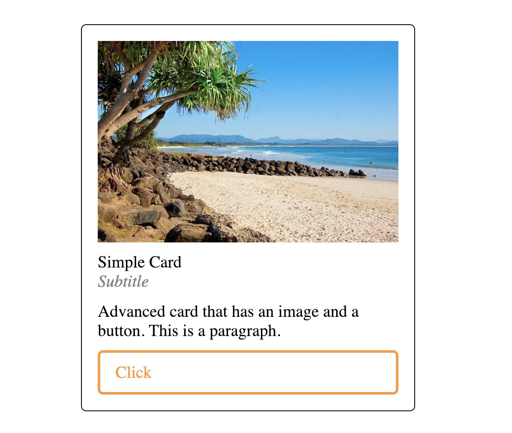
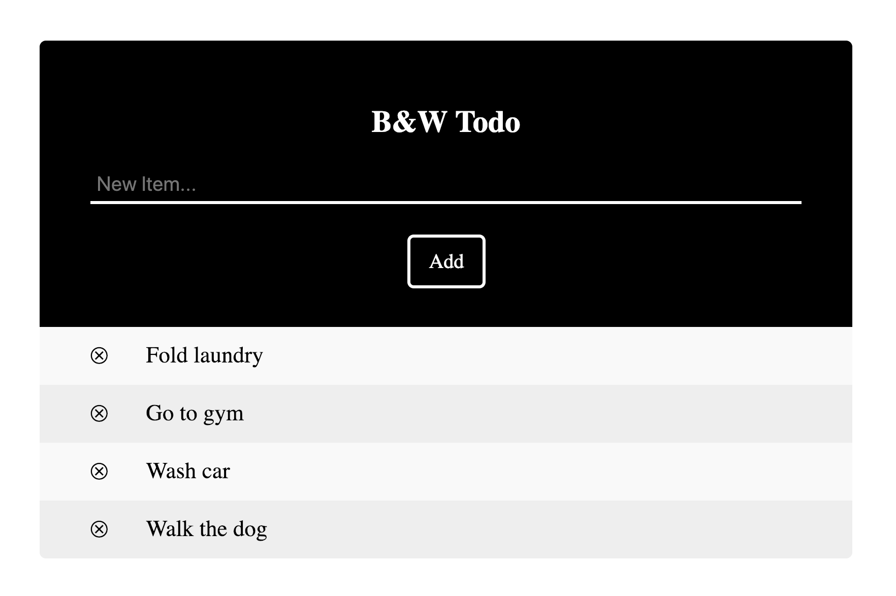
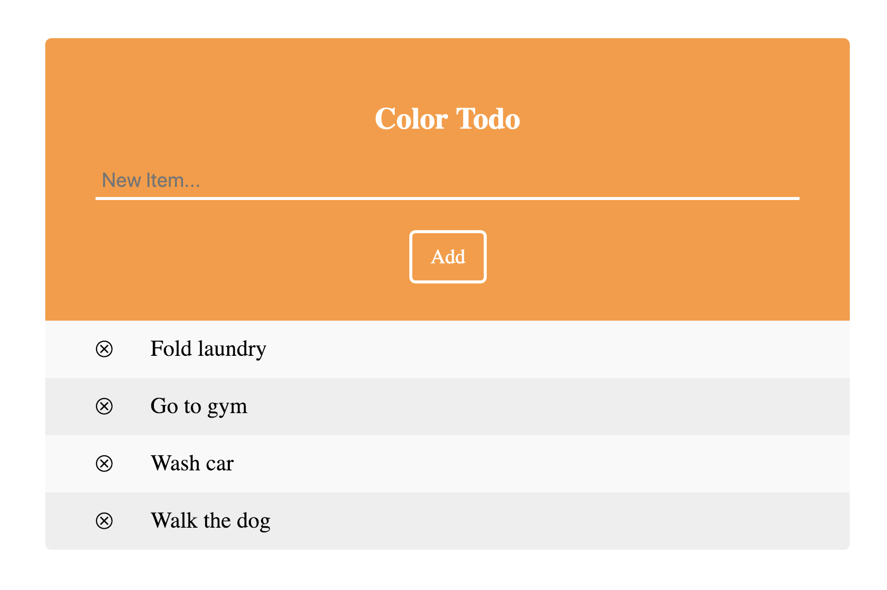

# Atomic10 Components

> Atomic10 is a React component library with clean, contemporary, and customizable components. New components will be created and added with future updates.

[![NPM Version][version-image]][version-url]
[![NPM Download][download-image]][download-url]

<!-- [![Linux Build][travis-image]][travis-url]
[![Test Coverage][coveralls-image]][coveralls-url] -->

## Install

Atomic10 components are simple to install and use.

```bash
npm i atomic10-components
```

## Usage

> ### Components:
>
> [Primary Button](#Primary-Button)  
> [Secondary Button](#Secondary-Button)
>
> [Simple Card](#Simple-Card)  
> [Advanced Card](#Advanced-Card)

### Primary Button



This primary button is a solid color button with rounded corners. There is a shrink hover effect on this button. Customize the color, text, and onClick function.

```
import { PrimaryButton } from "atomic10-components";

handleClick  =  ()  =>  {
	alert("Click");
};

<PrimaryButton  value="Click"  click={handleClick}  />
```

#### Properties

| Name      | Type     | Default       | Description                                    |
| --------- | -------- | ------------- | ---------------------------------------------- |
| `bkcolor` | string   | `Neon Carrot` | Background color. Accepts hex, rgb, and string |
| `click`   | function | `null`        | Callback for buttons onClick                   |
| `ftcolor` | string   | `White`       | Font color. Accepts hex, rgb, and string       |
| `value`   | string   | `null`        | Text of the button                             |

#### Styling

List of class names for styling.

| Name             | Element |
| ---------------- | ------- |
| `primary-button` | `div`   |

<hr />

### Secondary Button



This secondary button is a solid white button with colored border and text. This button has rounded corners. There is a shrink hover effect on this button. Customize the color, text, and onClick function.

```
import { SecondaryButton } from "atomic10-components";

handleClick  =  ()  =>  {
	alert("Click");
};

<SecondaryButton  value="Click"  click={handleClick}  />
```

#### Properties

| Name    | Type     | Default       | Description                                         |
| ------- | -------- | ------------- | --------------------------------------------------- |
| `click` | function | `null`        | Callback for buttons onClick                        |
| `color` | string   | `Neon Carrot` | Border and font color. Accepts hex, rgb, and string |
| `value` | string   | `null`        | Text of the button                                  |

#### Styling

List of class names for styling.

| Name               | Element |
| ------------------ | ------- |
| `secondary-button` | `div`   |

<hr />

### Simple Card



This is a simple card that can store data for a product, service, etc. Card can have an onClick added. All content is customizable and the box will auto format as info grows.

```
import { SimpleCard } from "atomic10-components";

handleClick  =  ()  =>  {
	alert("Click");
};

<SimpleCard
  title="Simple Card"
  subTitle="Subtitle"
  paragraph="Simple card that doesn't have an image and a button. This is a paragraph."
  click={() => alert("Card Click")}
/>
```

#### Properties

| Name        | Type     | Default | Description                                         |
| ----------- | -------- | ------- | --------------------------------------------------- |
| `bkColor`   | string   | `White` | Card background color. Accepts hex, rgb, and string |
| `brdColor`  | string   | `Black` | Border color. Accepts hex, rgb, and string          |
| `click`     | function | `null`  | Callback for card onClick                           |
| `paragraph` | string   | `null`  | Paragraph for card                                  |
| `title`     | string   | `null`  | Text of the card                                    |
| `subTitle`  | string   | `null`  | Subtitle for card                                   |
| `width`     | string   | `30%`   | Width for card                                      |

#### Styling

List of class names for styling.

| Name               | Element |
| ------------------ | ------- |
| `secondary-button` | `div`   |
| `title`            | `div`   |
| `subtitle`         | `div`   |
| `paragraph`        | `div`   |

<hr />

### Advanced Card



This is an advanced card that can store data for a product, service, profile, etc. Card and button have separate customizable onClick. Image, content, and button are customizable and the box will auto format as info grows.

```
import { AdvancedCard } from "atomic10-components";

handleClick  =  ()  =>  {
	alert("Click");
};

<AdvancedCard
  title="Simple Card"
  subTitle="Subtitle"
  paragraph="Advanced card that has an image and a button. This is a paragraph."
  click={() => alert("Card Click")}
  btnClick={() => alert("Button Click")}
  btnValue="Click"
  image="https://goo.gl/2QuCc5"
  width="50%"
/>
```

#### Properties

| Name        | Type     | Default       | Description                                         |
| ----------- | -------- | ------------- | --------------------------------------------------- |
| `bkColor`   | string   | `White`       | Card background color. Accepts hex, rgb, and string |
| `brdColor`  | string   | `Black`       | Border color. Accepts hex, rgb, and string          |
| `btnClick`  | function | `null`        | Callback for button onClick                         |
| `btnColor`  | string   | `Neon Carrot` | Button color. Accepts hex, rgb, and string          |
| `btnValue`  | string   | `Black`       | Text of the button                                  |
| `click`     | function | `null`        | Callback for card onClick                           |
| `image`     | image    | `null`        | Image for header                                    |
| `paragraph` | string   | `null`        | Paragraph for card                                  |
| `title`     | string   | `null`        | Text of the card                                    |
| `subTitle`  | string   | `null`        | Subtitle for card                                   |
| `width`     | string   | `30%`         | Width for card                                      |

#### Styling

List of class names for styling.

| Name              | Element |
| ----------------- | ------- |
| `advanced-button` | `div`   |
| `img`             | `img`   |
| `title`           | `div`   |
| `subtitle`        | `div`   |
| `paragraph`       | `div`   |

<hr />

### Black and White To Do Form



This is a black and white todo form. Items can be added to the list directly on the component, can be deleted from list, and can be completed(crossed out). The list is persistent through localStorage. You can create a function that clears this storage by removing the key of: "`${title} list`" from localStorage.

```
import { BWTodo } from "atomic10-components";

const todoList = ["Fold laundry", "Go to gym", "Wash car", "Walk the dog"];

<BWTodo list={todoList} title="B&W Todo" />
```

#### Properties

| Name    | Type   | Default | Description                                 |
| ------- | ------ | ------- | ------------------------------------------- |
| `title` | string | `null`  | Title of the to do form in header           |
| `list`  | array  | `null`  | An array of to do items to prepopulate list |

#### Styling

List of class names for styling.

| Name                 | Element |
| -------------------- | ------- |
| `header`             | `div`   |
| `title`              | `h2`    |
| `myUL`(id not class) | `ul`    |

<hr />

### Colored To Do Form



This is a customizable colored todo form. Items can be added to the list directly on the component, can be deleted from list, and can be completed(crossed out). The list is persistent through localStorage. You can create a function that clears this storage by removing the key of: "`${title} list`" from localStorage. Colors, title, placeholder, and more can be customized.

```
import { CTodo } from "atomic10-components";

const todoList = ["Fold laundry", "Go to gym", "Wash car", "Walk the dog"];

<CTodo list={todoList} title="Color Todo" placeholder="New Item..." />
```

#### Properties

| Name          | Type   | Default       | Description                                           |
| ------------- | ------ | ------------- | ----------------------------------------------------- |
| `title`       | string | `null`        | Title of the to do form in header                     |
| `list`        | array  | `null`        | An array of to do items to prepopulate list           |
| `placeholder` | string | `null`        | Placeholder for form input                            |
| `bkColor`     | string | `Neon Carrot` | Header background color. Accepts hex, rgb, and string |
| `ftColor`     | string | `White`       | Input font color. Accepts hex, rgb, and string        |
| `inColor`     | string | `White`       | Input line color. Accepts hex, rgb, and string        |
| `btnColor`    | string | `White`       | Button and title color. Accepts hex, rgb, and string  |

#### Styling

List of class names for styling.

| Name                 | Element |
| -------------------- | ------- |
| `color-todo`         | `div`   |
| `header`             | `div`   |
| `myUL`(id not class) | `ul`    |

<hr />

## License

<!-- [MIT](http://vjpr.mit-license.org) -->

Coming Soon...

## Issues and Issue Tracker

Coming Soon...

[version-image]: https://img.shields.io/npm/v/atomic10-components.svg
[version-url]: https://npmjs.org/package/atomic10-components
[download-image]: https://img.shields.io/npm/dt/atomic10-components.svg
[download-url]: https://npmjs.org/package/atomic10-components
